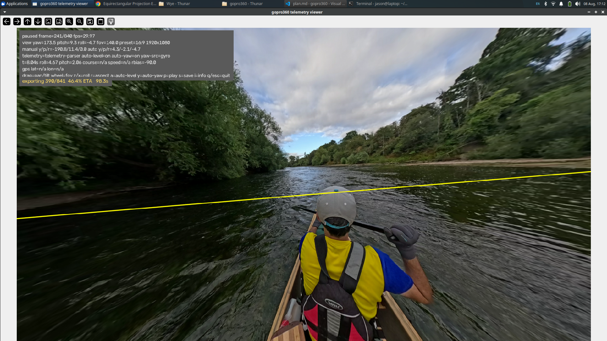

# gopro360

Interactive OpenCV viewer for 360-degree equirectangular video with live dewarp controls and full-video export.

## Run with uv

Install dependencies:

```bash
uv sync
```

Launch viewer:

```bash
uv run gopro360 /path/to/input.mp4
```

Launch with options:

```bash
uv run gopro360 /path/to/input.mp4 \
  --output /path/to/output.mp4 \
  --yaw 0 --pitch 0 --roll 0 --fov 90 --preset 1
```

Launch telemetry-aware viewer:

```bash
uv run python viewer-telemetry.py /path/to/input_with_telemetry.mov
```

## Controls

- Left mouse drag: pan (yaw) and tilt (pitch)
- Mouse wheel: adjust FOV
- `r`: cycle window aspect presets
  - 1:1 -> 1080x1080
  - 16:9 -> 1920x1080
  - 9:16 -> 1080x1920
  - 4:3 -> 1440x1080
- `z` / `x`: roll -/+ 1 degree
- `p`: pause or resume playback
- `i`: toggle on-screen info panel
- `s`: export full video from frame 0 using current settings snapshot
- `q` or `Esc`: quit

## Notes

- Viewer starts windowed (not fullscreen).
- First frame is shown immediately in dewarped perspective.
- Export prints progress in terminal and overlays export status in the viewer.
- Export target is MP4; writer prefers H.264 and falls back to mp4v if needed.


## Telemetry

My steams have the following data that can be extrated with y_gpmf_parser  ( https://github.com/gopro/gpmf-parser )


```
(gopro360) jason@laptop:~/work/gopro360$ uv run dump_gpmf.py 
=== Extraction Summary for GS010014-eqr-prores-telemetry.mov ===

✅ Found 'ACCL' stream:
   • Total Samples : 842
   • Time Range    : -0.0038s to 28.0518s
   • First Sample  : [ 9.81294964 -0.50359712 -0.76738609]
   • Last Sample   : [ 9.83453237 -0.07913669 -0.86330935]
✅ Found 'GYRO' stream:
   • Total Samples : 842
   • Time Range    : -0.0038s to 28.0519s
   • First Sample  : [ 0.04898829 -0.00106496  0.02981896]
   • Last Sample   : [ 0.0543131   0.         -0.01277955]
⚠️  Stream 'GPS5': Present in schema but contains 0 samples.
✅ Found 'GPS9' stream:
   • Total Samples : 841
   • Time Range    : 0.0199s to 28.0755s
   • First Sample  : [ 0.00000e+00  0.00000e+00 -1.70000e+01  0.00000e+00  0.00000e+00
  7.73700e+03  2.25165e+04  9.99900e+01  0.00000e+00]
   • Last Sample   : [ 5.19068105e+01 -2.62023280e+00  3.10580000e+01  1.62300000e+00
  1.52000000e+00  9.70400000e+03  2.27966000e+04  2.41000000e+00
  3.00000000e+00]
✅ Found 'GRAV' stream:
   • Total Samples : 841
   • Time Range    : 0.0000s to 28.0223s
   • First Sample  : [-0.05499435  0.99526963 -0.07986694]
   • Last Sample   : [-0.01895199  0.99682608 -0.07727287]
✅ Found 'CORI' stream:
   • Total Samples : 841
   • Time Range    : 0.0000s to 28.0223s
   • First Sample  : [1.00000000e+00 0.00000000e+00 1.09866634e-03 7.32444227e-04]
   • Last Sample   : [ 0.66109195 -0.141789    0.72264779 -0.14371166]
✅ Found 'SHUT' stream:
   • Total Samples : 841
   • Time Range    : 0.0000s to 28.0223s
   • First Sample  : [0.00082077]
   • Last Sample   : [0.00072911]
✅ Found 'ISOE' stream:
   • Total Samples : 841
   • Time Range    : 0.0000s to 28.0223s
   • First Sample  : [100.]
   • Last Sample   : [100.]
```
detalis aout GPMF can be found https://github.com/gopro/gpmf-parser


## Telemetry Viewer



- Uses `telemetry-parser` for normalized IMU samples.
- Uses `gpmf` GPS stream parsing for course vectoring.
- Auto-level (`a`) is ON by default.
- Auto-yaw (`y`) is ON by default.
- Telemetry status, source, and live values appear in the gray info panel while playing.

### Telemetry Controls

- `a`: toggle auto-level (roll and pitch from telemetry)
- `y`: toggle auto-yaw (GPS course primary, gyro yaw-rate fallback)
- `i`: toggle info panel visibility

## Future Auto-Yaw Options

- Optical-flow focus-of-expansion heading from frame motion when GPS is weak.
- Visual vanishing-point heading from structural cues (trees/cliffs/riverbanks).
- Hybrid yaw fusion that blends GPS, gyro integration, and visual heading with confidence weights.

## Converting

~/Videos/Wye/GS010014.360

For use here:

```
ffmpeg -y -i ~/Videos/Wye/GS010014.360 \
  -progress pipe:1 -stats_period 1.0 \
  -filter_complex "[0:0]crop=624:1344:x=0:y=0,format=yuvj420p[LEFTFRAME_left_slice]; \
[0:0]crop=128:1344:x=624:y=0,format=yuvj420p,geq=lum='if(between(X, 0, 64), (p((X+64),Y)*(((X+1))/65))+(p(X,Y)*((65-((X+1)))/65)), p(X,Y))':cb='if(between(X, 0, 64), (p((X+64),Y)*(((X+1))/65))+(p(X,Y)*((65-((X+1)))/65)), p(X,Y))':cr='if(between(X, 0, 64), (p((X+64),Y)*(((X+1))/65))+(p(X,Y)*((65-((X+1)))/65)), p(X,Y))':a='if(between(X, 0, 64), (p((X+64),Y)*(((X+1))/65))+(p(X,Y)*((65-((X+1)))/65)), p(X,Y))',crop=64:1344:x=0:y=0,format=yuvj420p,scale=96:1344[LEFTFRAME_overlap_slice]; \
[0:0]crop=624:1344:x=752:y=0,format=yuvj420p[LEFTFRAME_right_slice]; \
[LEFTFRAME_left_slice][LEFTFRAME_overlap_slice]hstack[LEFTFRAME_left_and_overlap_joined]; \
[LEFTFRAME_left_and_overlap_joined][LEFTFRAME_right_slice]hstack[LEFTFRAME_completed]; \
[0:0]crop=1344:1344:1376:0[CENTERFRAME_completed]; \
[0:0]crop=624:1344:x=2720:y=0,format=yuvj420p[RIGHTFRAME_left_slice]; \
[0:0]crop=128:1344:x=3344:y=0,format=yuvj420p,geq=lum='if(between(X, 0, 64), (p((X+64),Y)*(((X+1))/65))+(p(X,Y)*((65-((X+1)))/65)), p(X,Y))':cb='if(between(X, 0, 64), (p((X+64),Y)*(((X+1))/65))+(p(X,Y)*((65-((X+1)))/65)), p(X,Y))':cr='if(between(X, 0, 64), (p((X+64),Y)*(((X+1))/65))+(p(X,Y)*((65-((X+1)))/65)), p(X,Y))':a='if(between(X, 0, 64), (p((X+64),Y)*(((X+1))/65))+(p(X,Y)*((65-((X+1)))/65)), p(X,Y))',crop=64:1344:x=0:y=0,format=yuvj420p,scale=96:1344[RIGHTFRAME_overlap_slice]; \
[0:0]crop=624:1344:x=3472:y=0,format=yuvj420p[RIGHTFRAME_right_slice]; \
[RIGHTFRAME_left_slice][RIGHTFRAME_overlap_slice]hstack[RIGHTFRAME_left_and_overlap_joined]; \
[RIGHTFRAME_left_and_overlap_joined][RIGHTFRAME_right_slice]hstack[RIGHTFRAME_completed]; \
[LEFTFRAME_completed][CENTERFRAME_completed]hstack[LEFT_CENTER_frames_joined]; \
[LEFT_CENTER_frames_joined][RIGHTFRAME_completed]hstack[LEFT_CENTER_RIGHT_completed]; \
[0:4]crop=624:1344:x=0:y=0,format=yuvj420p[BOTTOMFRAME_left_slice]; \
[0:4]crop=128:1344:x=624:y=0,format=yuvj420p,geq=lum='if(between(X, 0, 64), (p((X+64),Y)*(((X+1))/65))+(p(X,Y)*((65-((X+1)))/65)), p(X,Y))':cb='if(between(X, 0, 64), (p((X+64),Y)*(((X+1))/65))+(p(X,Y)*((65-((X+1)))/65)), p(X,Y))':cr='if(between(X, 0, 64), (p((X+64),Y)*(((X+1))/65))+(p(X,Y)*((65-((X+1)))/65)), p(X,Y))':a='if(between(X, 0, 64), (p((X+64),Y)*(((X+1))/65))+(p(X,Y)*((65-((X+1)))/65)), p(X,Y))',crop=64:1344:x=0:y=0,format=yuvj420p,scale=96:1344[BOTTOMFRAME_overlap_slice]; \
[0:4]crop=624:1344:x=752:y=0,format=yuvj420p[BOTTOMFRAME_right_slice]; \
[BOTTOMFRAME_left_slice][BOTTOMFRAME_overlap_slice]hstack[BOTTOMFRAME_left_and_overlap_joined]; \
[BOTTOMFRAME_left_and_overlap_joined][BOTTOMFRAME_right_slice]hstack[BOTTOMFRAME_completed]; \
[0:4]crop=1344:1344:1376:0[BACKFRAME_completed]; \
[0:4]crop=624:1344:x=2720:y=0,format=yuvj420p[TOPFRAME_left_slice]; \
[0:4]crop=128:1344:x=3344:y=0,format=yuvj420p,geq=lum='if(between(X, 0, 64), (p((X+64),Y)*(((X+1))/65))+(p(X,Y)*((65-((X+1)))/65)), p(X,Y))':cb='if(between(X, 0, 64), (p((X+64),Y)*(((X+1))/65))+(p(X,Y)*((65-((X+1)))/65)), p(X,Y))':cr='if(between(X, 0, 64), (p((X+64),Y)*(((X+1))/65))+(p(X,Y)*((65-((X+1)))/65)), p(X,Y))':a='if(between(X, 0, 64), (p((X+64),Y)*(((X+1))/65))+(p(X,Y)*((65-((X+1)))/65)), p(X,Y))',crop=64:1344:x=0:y=0,format=yuvj420p,scale=96:1344[TOPFRAME_overlap_slice]; \
[0:4]crop=624:1344:x=3472:y=0,format=yuvj420p[TOPFRAME_right_slice]; \
[TOPFRAME_left_slice][TOPFRAME_overlap_slice]hstack[TOPFRAME_left_and_overlap_joined]; \
[TOPFRAME_left_and_overlap_joined][TOPFRAME_right_slice]hstack[TOPFRAME_completed]; \
[BOTTOMFRAME_completed][BACKFRAME_completed]hstack[BOTTOM_BACK_frames_joined]; \
[BOTTOM_BACK_frames_joined][TOPFRAME_completed]hstack[BOTTOM_BACK_TOP_completed]; \
[LEFT_CENTER_RIGHT_completed][BOTTOM_BACK_TOP_completed]vstack[FULL_EAC_FRAME]; \
[FULL_EAC_FRAME]v360=eac:equirect:interp=cubic:roll=0:pitch=0:yaw=0,crop=4032:2388:x=0:y=0[OUTPUT_FRAME]" \
  -map 0:a:0 -map "[OUTPUT_FRAME]" \
  -c:a pcm_s16le -c:v prores -f mov \
  -map 0:d? -c:d copy \
  ./GS010014-eqr-prores-telemetry.mov
```


### Insta360

For conversion for use with Insta360 Android app
```
ffmpeg -y -i ~/Videos/Wye/GS010014.360 \
  -progress pipe:1 -stats_period 1.0 \
  -filter_complex "[0:0]crop=624:1344:x=0:y=0,format=yuvj420p[LEFTFRAME_left_slice]; \
[0:0]crop=128:1344:x=624:y=0,format=yuvj420p,geq=lum='if(between(X, 0, 64), (p((X+64),Y)*(((X+1))/65))+(p(X,Y)*((65-((X+1)))/65)), p(X,Y))':cb='if(between(X, 0, 64), (p((X+64),Y)*(((X+1))/65))+(p(X,Y)*((65-((X+1)))/65)), p(X,Y))':cr='if(between(X, 0, 64), (p((X+64),Y)*(((X+1))/65))+(p(X,Y)*((65-((X+1)))/65)), p(X,Y))':a='if(between(X, 0, 64), (p((X+64),Y)*(((X+1))/65))+(p(X,Y)*((65-((X+1)))/65)), p(X,Y))',crop=64:1344:x=0:y=0,format=yuvj420p,scale=96:1344[LEFTFRAME_overlap_slice]; \
[0:0]crop=624:1344:x=752:y=0,format=yuvj420p[LEFTFRAME_right_slice]; \
[LEFTFRAME_left_slice][LEFTFRAME_overlap_slice]hstack[LEFTFRAME_left_and_overlap_joined]; \
[LEFTFRAME_left_and_overlap_joined][LEFTFRAME_right_slice]hstack[LEFTFRAME_completed]; \
[0:0]crop=1344:1344:1376:0[CENTERFRAME_completed]; \
[0:0]crop=624:1344:x=2720:y=0,format=yuvj420p[RIGHTFRAME_left_slice]; \
[0:0]crop=128:1344:x=3344:y=0,format=yuvj420p,geq=lum='if(between(X, 0, 64), (p((X+64),Y)*(((X+1))/65))+(p(X,Y)*((65-((X+1)))/65)), p(X,Y))':cb='if(between(X, 0, 64), (p((X+64),Y)*(((X+1))/65))+(p(X,Y)*((65-((X+1)))/65)), p(X,Y))':cr='if(between(X, 0, 64), (p((X+64),Y)*(((X+1))/65))+(p(X,Y)*((65-((X+1)))/65)), p(X,Y))':a='if(between(X, 0, 64), (p((X+64),Y)*(((X+1))/65))+(p(X,Y)*((65-((X+1)))/65)), p(X,Y))',crop=64:1344:x=0:y=0,format=yuvj420p,scale=96:1344[RIGHTFRAME_overlap_slice]; \
[0:0]crop=624:1344:x=3472:y=0,format=yuvj420p[RIGHTFRAME_right_slice]; \
[RIGHTFRAME_left_slice][RIGHTFRAME_overlap_slice]hstack[RIGHTFRAME_left_and_overlap_joined]; \
[RIGHTFRAME_left_and_overlap_joined][RIGHTFRAME_right_slice]hstack[RIGHTFRAME_completed]; \
[LEFTFRAME_completed][CENTERFRAME_completed]hstack[LEFT_CENTER_frames_joined]; \
[LEFT_CENTER_frames_joined][RIGHTFRAME_completed]hstack[LEFT_CENTER_RIGHT_completed]; \
[0:4]crop=624:1344:x=0:y=0,format=yuvj420p[BOTTOMFRAME_left_slice]; \
[0:4]crop=128:1344:x=624:y=0,format=yuvj420p,geq=lum='if(between(X, 0, 64), (p((X+64),Y)*(((X+1))/65))+(p(X,Y)*((65-((X+1)))/65)), p(X,Y))':cb='if(between(X, 0, 64), (p((X+64),Y)*(((X+1))/65))+(p(X,Y)*((65-((X+1)))/65)), p(X,Y))':cr='if(between(X, 0, 64), (p((X+64),Y)*(((X+1))/65))+(p(X,Y)*((65-((X+1)))/65)), p(X,Y))':a='if(between(X, 0, 64), (p((X+64),Y)*(((X+1))/65))+(p(X,Y)*((65-((X+1)))/65)), p(X,Y))',crop=64:1344:x=0:y=0,format=yuvj420p,scale=96:1344[BOTTOMFRAME_overlap_slice]; \
[0:4]crop=624:1344:x=752:y=0,format=yuvj420p[BOTTOMFRAME_right_slice]; \
[BOTTOMFRAME_left_slice][BOTTOMFRAME_overlap_slice]hstack[BOTTOMFRAME_left_and_overlap_joined]; \
[BOTTOMFRAME_left_and_overlap_joined][BOTTOMFRAME_right_slice]hstack[BOTTOMFRAME_completed]; \
[0:4]crop=1344:1344:1376:0[BACKFRAME_completed]; \
[0:4]crop=624:1344:x=2720:y=0,format=yuvj420p[TOPFRAME_left_slice]; \
[0:4]crop=128:1344:x=3344:y=0,format=yuvj420p,geq=lum='if(between(X, 0, 64), (p((X+64),Y)*(((X+1))/65))+(p(X,Y)*((65-((X+1)))/65)), p(X,Y))':cb='if(between(X, 0, 64), (p((X+64),Y)*(((X+1))/65))+(p(X,Y)*((65-((X+1)))/65)), p(X,Y))':cr='if(between(X, 0, 64), (p((X+64),Y)*(((X+1))/65))+(p(X,Y)*((65-((X+1)))/65)), p(X,Y))':a='if(between(X, 0, 64), (p((X+64),Y)*(((X+1))/65))+(p(X,Y)*((65-((X+1)))/65)), p(X,Y))',crop=64:1344:x=0:y=0,format=yuvj420p,scale=96:1344[TOPFRAME_overlap_slice]; \
[0:4]crop=624:1344:x=3472:y=0,format=yuvj420p[TOPFRAME_right_slice]; \
[TOPFRAME_left_slice][TOPFRAME_overlap_slice]hstack[TOPFRAME_left_and_overlap_joined]; \
[TOPFRAME_left_and_overlap_joined][TOPFRAME_right_slice]hstack[TOPFRAME_completed]; \
[BOTTOMFRAME_completed][BACKFRAME_completed]hstack[BOTTOM_BACK_frames_joined]; \
[BOTTOM_BACK_frames_joined][TOPFRAME_completed]hstack[BOTTOM_BACK_TOP_completed]; \
[LEFT_CENTER_RIGHT_completed][BOTTOM_BACK_TOP_completed]vstack[FULL_EAC_FRAME]; \
[FULL_EAC_FRAME]v360=eac:equirect:interp=cubic:roll=0:pitch=0:yaw=0,crop=4032:2388:x=0:y=0[OUTPUT_FRAME]" \
  -map 0:a:0 -map "[OUTPUT_FRAME]" \
  -c:a pcm_s16le -c:v prores -f mov \
  ./GS010014-eqr-prores.mov


# 1. Scale video to 2:1 ratio with faststart header
ffmpeg -i ./GS010014-eqr-prores.mov -vf "scale=4032:2016" -c:v libx264 -preset slow -crf 18 -pix_fmt yuv420p -movflags +faststart -c:a aac -b:a 192k ./GS010014-eqr_insta.mp4

```


Maybe possibe to go direct
```

ffmpeg -y -i ~/Videos/Wye/GS010014.360 \
  -progress pipe:1 -stats_period 1.0 \
  -filter_complex "[0:0]crop=624:1344:x=0:y=0,format=yuvj420p[LEFTFRAME_left_slice]; \
[0:0]crop=128:1344:x=624:y=0,format=yuvj420p,geq=lum='if(between(X, 0, 64), (p((X+64),Y)*(((X+1))/65))+(p(X,Y)*((65-((X+1)))/65)), p(X,Y))':cb='if(between(X, 0, 64), (p((X+64),Y)*(((X+1))/65))+(p(X,Y)*((65-((X+1)))/65)), p(X,Y))':cr='if(between(X, 0, 64), (p((X+64),Y)*(((X+1))/65))+(p(X,Y)*((65-((X+1)))/65)), p(X,Y))':a='if(between(X, 0, 64), (p((X+64),Y)*(((X+1))/65))+(p(X,Y)*((65-((X+1)))/65)), p(X,Y))',crop=64:1344:x=0:y=0,format=yuvj420p,scale=96:1344[LEFTFRAME_overlap_slice]; \
[0:0]crop=624:1344:x=752:y=0,format=yuvj420p[LEFTFRAME_right_slice]; \
[LEFTFRAME_left_slice][LEFTFRAME_overlap_slice]hstack[LEFTFRAME_left_and_overlap_joined]; \
[LEFTFRAME_left_and_overlap_joined][LEFTFRAME_right_slice]hstack[LEFTFRAME_completed]; \
[0:0]crop=1344:1344:1376:0[CENTERFRAME_completed]; \
[0:0]crop=624:1344:x=2720:y=0,format=yuvj420p[RIGHTFRAME_left_slice]; \
[0:0]crop=128:1344:x=3344:y=0,format=yuvj420p,geq=lum='if(between(X, 0, 64), (p((X+64),Y)*(((X+1))/65))+(p(X,Y)*((65-((X+1)))/65)), p(X,Y))':cb='if(between(X, 0, 64), (p((X+64),Y)*(((X+1))/65))+(p(X,Y)*((65-((X+1)))/65)), p(X,Y))':cr='if(between(X, 0, 64), (p((X+64),Y)*(((X+1))/65))+(p(X,Y)*((65-((X+1)))/65)), p(X,Y))':a='if(between(X, 0, 64), (p((X+64),Y)*(((X+1))/65))+(p(X,Y)*((65-((X+1)))/65)), p(X,Y))',crop=64:1344:x=0:y=0,format=yuvj420p,scale=96:1344[RIGHTFRAME_overlap_slice]; \
[0:0]crop=624:1344:x=3472:y=0,format=yuvj420p[RIGHTFRAME_right_slice]; \
[RIGHTFRAME_left_slice][RIGHTFRAME_overlap_slice]hstack[RIGHTFRAME_left_and_overlap_joined]; \
[RIGHTFRAME_left_and_overlap_joined][RIGHTFRAME_right_slice]hstack[RIGHTFRAME_completed]; \
[LEFTFRAME_completed][CENTERFRAME_completed]hstack[LEFT_CENTER_frames_joined]; \
[LEFT_CENTER_frames_joined][RIGHTFRAME_completed]hstack[LEFT_CENTER_RIGHT_completed]; \
[0:4]crop=624:1344:x=0:y=0,format=yuvj420p[BOTTOMFRAME_left_slice]; \
[0:4]crop=128:1344:x=624:y=0,format=yuvj420p,geq=lum='if(between(X, 0, 64), (p((X+64),Y)*(((X+1))/65))+(p(X,Y)*((65-((X+1)))/65)), p(X,Y))':cb='if(between(X, 0, 64), (p((X+64),Y)*(((X+1))/65))+(p(X,Y)*((65-((X+1)))/65)), p(X,Y))':cr='if(between(X, 0, 64), (p((X+64),Y)*(((X+1))/65))+(p(X,Y)*((65-((X+1)))/65)), p(X,Y))':a='if(between(X, 0, 64), (p((X+64),Y)*(((X+1))/65))+(p(X,Y)*((65-((X+1)))/65)), p(X,Y))',crop=64:1344:x=0:y=0,format=yuvj420p,scale=96:1344[BOTTOMFRAME_overlap_slice]; \
[0:4]crop=624:1344:x=752:y=0,format=yuvj420p[BOTTOMFRAME_right_slice]; \
[BOTTOMFRAME_left_slice][BOTTOMFRAME_overlap_slice]hstack[BOTTOMFRAME_left_and_overlap_joined]; \
[BOTTOMFRAME_left_and_overlap_joined][BOTTOMFRAME_right_slice]hstack[BOTTOMFRAME_completed]; \
[0:4]crop=1344:1344:1376:0[BACKFRAME_completed]; \
[0:4]crop=624:1344:x=2720:y=0,format=yuvj420p[TOPFRAME_left_slice]; \
[0:4]crop=128:1344:x=3344:y=0,format=yuvj420p,geq=lum='if(between(X, 0, 64), (p((X+64),Y)*(((X+1))/65))+(p(X,Y)*((65-((X+1)))/65)), p(X,Y))':cb='if(between(X, 0, 64), (p((X+64),Y)*(((X+1))/65))+(p(X,Y)*((65-((X+1)))/65)), p(X,Y))':cr='if(between(X, 0, 64), (p((X+64),Y)*(((X+1))/65))+(p(X,Y)*((65-((X+1)))/65)), p(X,Y))':a='if(between(X, 0, 64), (p((X+64),Y)*(((X+1))/65))+(p(X,Y)*((65-((X+1)))/65)), p(X,Y))',crop=64:1344:x=0:y=0,format=yuvj420p,scale=96:1344[TOPFRAME_overlap_slice]; \
[0:4]crop=624:1344:x=3472:y=0,format=yuvj420p[TOPFRAME_right_slice]; \
[TOPFRAME_left_slice][TOPFRAME_overlap_slice]hstack[TOPFRAME_left_and_overlap_joined]; \
[TOPFRAME_left_and_overlap_joined][TOPFRAME_right_slice]hstack[TOPFRAME_completed]; \
[BOTTOMFRAME_completed][BACKFRAME_completed]hstack[BOTTOM_BACK_frames_joined]; \
[BOTTOM_BACK_frames_joined][TOPFRAME_completed]hstack[BOTTOM_BACK_TOP_completed]; \
[LEFT_CENTER_RIGHT_completed][BOTTOM_BACK_TOP_completed]vstack[FULL_EAC_FRAME]; \
[FULL_EAC_FRAME]v360=eac:equirect:interp=cubic:roll=0:pitch=0:yaw=0,crop=4032:2388:x=0:y=0[OUTPUT_FRAME]" \
  -map 0:a:0 -map "[OUTPUT_FRAME]" \
  -vf "scale=4032:2016" -c:v libx264 -preset slow -crf 18 -pix_fmt yuv420p -movflags +faststart -c:a aac -b:a 192k \
  ./GS010014-eqr_direct_insta.mp4

  ```


```

ffmpeg -y -i ~/Videos/Wye/GS010014.360 \
  -progress pipe:1 -stats_period 1.0 \
  -filter_complex "[0:0]crop=624:1344:x=0:y=0,format=yuvj420p[LEFTFRAME_left_slice]; \
[0:0]crop=128:1344:x=624:y=0,format=yuvj420p,geq=lum='if(between(X, 0, 64), (p((X+64),Y)*(((X+1))/65))+(p(X,Y)*((65-((X+1)))/65)), p(X,Y))':cb='if(between(X, 0, 64), (p((X+64),Y)*(((X+1))/65))+(p(X,Y)*((65-((X+1)))/65)), p(X,Y))':cr='if(between(X, 0, 64), (p((X+64),Y)*(((X+1))/65))+(p(X,Y)*((65-((X+1)))/65)), p(X,Y))':a='if(between(X, 0, 64), (p((X+64),Y)*(((X+1))/65))+(p(X,Y)*((65-((X+1)))/65)), p(X,Y))',crop=64:1344:x=0:y=0,format=yuvj420p,scale=96:1344[LEFTFRAME_overlap_slice]; \
[0:0]crop=624:1344:x=752:y=0,format=yuvj420p[LEFTFRAME_right_slice]; \
[LEFTFRAME_left_slice][LEFTFRAME_overlap_slice]hstack[LEFTFRAME_left_and_overlap_joined]; \
[LEFTFRAME_left_and_overlap_joined][LEFTFRAME_right_slice]hstack[LEFTFRAME_completed]; \
[0:0]crop=1344:1344:1376:0[CENTERFRAME_completed]; \
[0:0]crop=624:1344:x=2720:y=0,format=yuvj420p[RIGHTFRAME_left_slice]; \
[0:0]crop=128:1344:x=3344:y=0,format=yuvj420p,geq=lum='if(between(X, 0, 64), (p((X+64),Y)*(((X+1))/65))+(p(X,Y)*((65-((X+1)))/65)), p(X,Y))':cb='if(between(X, 0, 64), (p((X+64),Y)*(((X+1))/65))+(p(X,Y)*((65-((X+1)))/65)), p(X,Y))':cr='if(between(X, 0, 64), (p((X+64),Y)*(((X+1))/65))+(p(X,Y)*((65-((X+1)))/65)), p(X,Y))':a='if(between(X, 0, 64), (p((X+64),Y)*(((X+1))/65))+(p(X,Y)*((65-((X+1)))/65)), p(X,Y))',crop=64:1344:x=0:y=0,format=yuvj420p,scale=96:1344[RIGHTFRAME_overlap_slice]; \
[0:0]crop=624:1344:x=3472:y=0,format=yuvj420p[RIGHTFRAME_right_slice]; \
[RIGHTFRAME_left_slice][RIGHTFRAME_overlap_slice]hstack[RIGHTFRAME_left_and_overlap_joined]; \
[RIGHTFRAME_left_and_overlap_joined][RIGHTFRAME_right_slice]hstack[RIGHTFRAME_completed]; \
[LEFTFRAME_completed][CENTERFRAME_completed]hstack[LEFT_CENTER_frames_joined]; \
[LEFT_CENTER_frames_joined][RIGHTFRAME_completed]hstack[LEFT_CENTER_RIGHT_completed]; \
[0:4]crop=624:1344:x=0:y=0,format=yuvj420p[BOTTOMFRAME_left_slice]; \
[0:4]crop=128:1344:x=624:y=0,format=yuvj420p,geq=lum='if(between(X, 0, 64), (p((X+64),Y)*(((X+1))/65))+(p(X,Y)*((65-((X+1)))/65)), p(X,Y))':cb='if(between(X, 0, 64), (p((X+64),Y)*(((X+1))/65))+(p(X,Y)*((65-((X+1)))/65)), p(X,Y))':cr='if(between(X, 0, 64), (p((X+64),Y)*(((X+1))/65))+(p(X,Y)*((65-((X+1)))/65)), p(X,Y))':a='if(between(X, 0, 64), (p((X+64),Y)*(((X+1))/65))+(p(X,Y)*((65-((X+1)))/65)), p(X,Y))',crop=64:1344:x=0:y=0,format=yuvj420p,scale=96:1344[BOTTOMFRAME_overlap_slice]; \
[0:4]crop=624:1344:x=752:y=0,format=yuvj420p[BOTTOMFRAME_right_slice]; \
[BOTTOMFRAME_left_slice][BOTTOMFRAME_overlap_slice]hstack[BOTTOMFRAME_left_and_overlap_joined]; \
[BOTTOMFRAME_left_and_overlap_joined][BOTTOMFRAME_right_slice]hstack[BOTTOMFRAME_completed]; \
[0:4]crop=1344:1344:1376:0[BACKFRAME_completed]; \
[0:4]crop=624:1344:x=2720:y=0,format=yuvj420p[TOPFRAME_left_slice]; \
[0:4]crop=128:1344:x=3344:y=0,format=yuvj420p,geq=lum='if(between(X, 0, 64), (p((X+64),Y)*(((X+1))/65))+(p(X,Y)*((65-((X+1)))/65)), p(X,Y))':cb='if(between(X, 0, 64), (p((X+64),Y)*(((X+1))/65))+(p(X,Y)*((65-((X+1)))/65)), p(X,Y))':cr='if(between(X, 0, 64), (p((X+64),Y)*(((X+1))/65))+(p(X,Y)*((65-((X+1)))/65)), p(X,Y))':a='if(between(X, 0, 64), (p((X+64),Y)*(((X+1))/65))+(p(X,Y)*((65-((X+1)))/65)), p(X,Y))',crop=64:1344:x=0:y=0,format=yuvj420p,scale=96:1344[TOPFRAME_overlap_slice]; \
[0:4]crop=624:1344:x=3472:y=0,format=yuvj420p[TOPFRAME_right_slice]; \
[TOPFRAME_left_slice][TOPFRAME_overlap_slice]hstack[TOPFRAME_left_and_overlap_joined]; \
[TOPFRAME_left_and_overlap_joined][TOPFRAME_right_slice]hstack[TOPFRAME_completed]; \
[BOTTOMFRAME_completed][BACKFRAME_completed]hstack[BOTTOM_BACK_frames_joined]; \
[BOTTOM_BACK_frames_joined][TOPFRAME_completed]hstack[BOTTOM_BACK_TOP_completed]; \
[LEFT_CENTER_RIGHT_completed][BOTTOM_BACK_TOP_completed]vstack[FULL_EAC_FRAME]; \
[FULL_EAC_FRAME]v360=eac:equirect:interp=cubic:roll=0:pitch=0:yaw=0,crop=4032:2388:x=0:y=0[OUTPUT_FRAME]" \
  -map 0:a:0 -map "[OUTPUT_FRAME]" \
  -vf "scale=4032:2016" -c:v libx264 -preset slow -crf 18 -pix_fmt yuv420p -movflags +faststart -c:a aac -b:a 192k \
  -map 0:d? -c:d copy \
  ./GS010014-eqr_direct_telemetry_insta.mp4

  ```